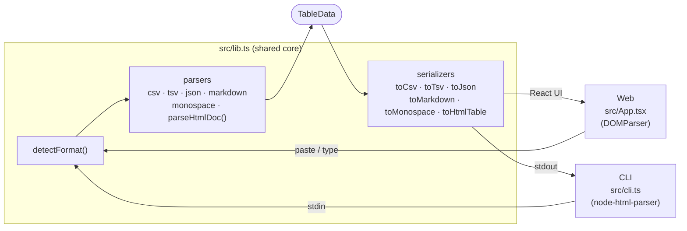

# TableShift

Paste a table in any format — get it back in any other format.

Supports **Markdown (GFM)**, **CSV**, **TSV**, **HTML**, **JSON**, and **Monospace** as both input and output. Format is auto-detected on paste.

## Architecture



### Key design decisions

| Concern | Decision |
|---|---|
| Shared logic | All parsing and serialization lives in `src/lib.ts` with no browser or Node.js dependencies |
| HTML parsing | Abstracted behind a `HtmlDocLike` interface; browser uses `DOMParser`, CLI uses `node-html-parser` |
| Format dispatch | `parseInput(input, parseHtml)` centralizes format detection → parser routing for both surfaces |
| Conversion registry | `CONVERSIONS` maps the six function names (`toCsv`, `toTsv`, …) to serializers — the CLI argument is the key |

## CLI

Read from stdin, auto-detect format, write converted output to stdout.

```bash
# One-off via npx
echo "Name,Age\nAlice,30\nBob,25" | npx tsx src/cli.ts toMarkdown

# Or via the npm script
cat data.json | npm run cli -- toMonospace
cat table.html | npm run cli -- toCsv
```

**Conversions:** `toCsv` · `toTsv` · `toHtmlTable` · `toJson` · `toMarkdown` · `toMonospace`

**Input formats detected automatically:** Markdown · CSV · TSV · HTML · JSON · Monospace

## Web app

**Prerequisites:** Node.js 18+

```bash
# Install dependencies
npm install

# Start dev server with hot reload
npm run dev
```

The app is served at **http://localhost:5173**.

```bash
# Type-check
npx tsc --noEmit

# Production build
npm run build

# Preview production build
npm run preview
```
